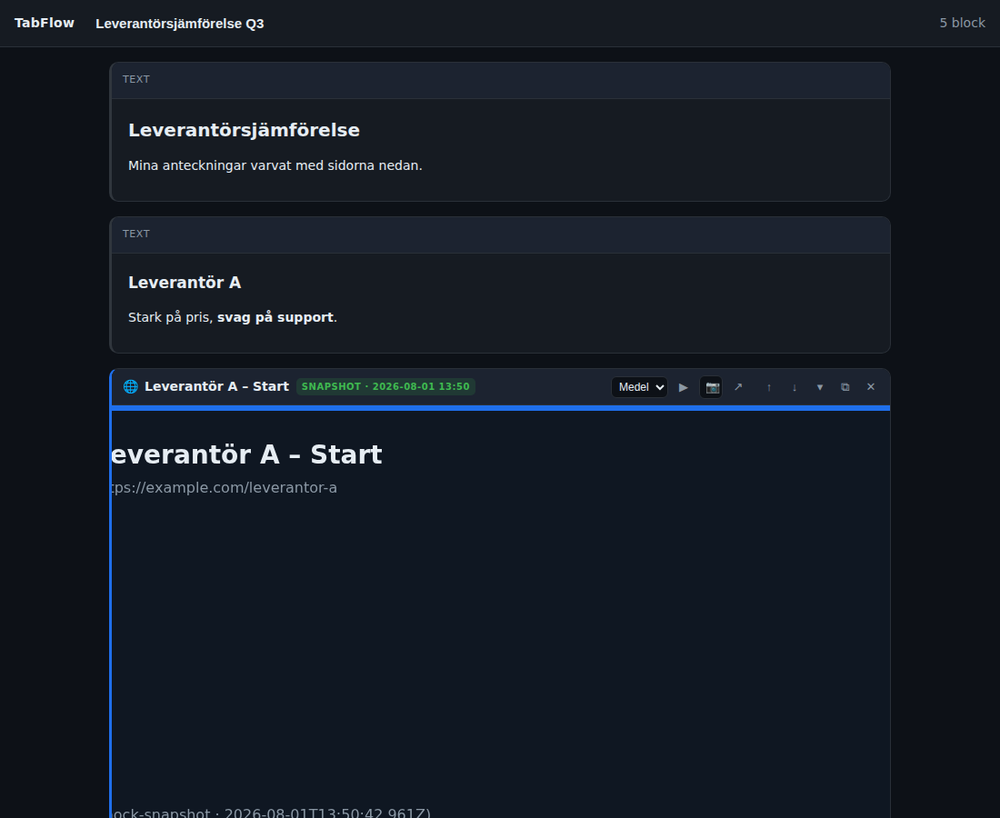

# TabFlow-app (M1) — spårsagnostiskt UI-skal

React + TypeScript + `@tanstack/react-virtual`. Konsumerar domänkärnan (`../domain`) via
en Vite-alias till dess källa. Detta är M1: **virtualiserat flöde, textblock och
blockoperationer**, plus en **mock snapshot-renderare** så hela dubbel-artefakt-flödet
(F-SNAP-1) och live/snapshot-växeln (F-SNAPWF-8) går att köra i webbläsaren innan Spår A finns.



## Kör

```bash
npm install
npm run dev        # http://localhost:5173
npm run build      # tsc --noEmit + vite build
```

## Vad som finns (M1)

| Krav | Var |
|---|---|
| Virtualiserat scrollflöde, höjdreservation (F-PERF-1, F-LAZY-1/7) | `ui/FlowView.tsx` |
| Textblock, Markdown redigera/rendera (F-TXT-1/2) | `ui/TextBlockView.tsx`, `lib/markdown.ts` |
| Sidblock: huvud med all chrome, snapshot/live-badge, öppna-flik (F-SID, F-UX-2) | `ui/PageBlockView.tsx` |
| Add/insert/move/collapse/duplicate/delete (F-BLK-1..6) | `ui/InsertZone.tsx`, `ui/BlockChrome.tsx`, `state/useDocument.ts` |
| Dubbel-artefakt snapshot (mock) + live/snapshot-växel (F-SNAP-1, F-SNAPWF-8) | `adapters/MockSnapshotRenderer.ts` |
| Autospar till localStorage (F-UX-7) | `state/useDocument.ts`, `adapters/LocalStorageDocumentStore.ts` |

## Arkitektur — portarna är poängen

`src/ports/index.ts` fryser gränssnitten från avsnitt 6.2, **informerade av Spike E1**:

- `SidblockRenderer.render(block, host)` får en `SidblockHost` med `container` (för DOM-chrome +
  snapshot-bild) **och** `getContentRect()` (rektangeln där ett native live-lager ska ligga).
  Det bakar in spike-fyndet: DOM-chrome kan inte ligga ovanpå en `WebContentsView`, så chrome
  och innehåll separeras redan i porten.
- `SidblockHandle` har `setLifecycle` (lazy-loading), `syncBounds` (Spår B: flytta native-vy),
  `setDisplay` (live/snapshot) och `dispose` (frigör resurser).

Adaptrar (`src/adapters/`) är utbytbara per spår:

| Port | M1 (dev) | Spår A (M2) | Spår B (M4) |
|---|---|---|---|
| `SidblockRenderer` | `MockSnapshotRenderer` | `ChromeSnapshotRenderer` | `WebviewRenderer` |
| `BlobStore` | `MemoryBlobStore` | IndexedDB | filsystem |
| `DocumentStore` | `LocalStorageDocumentStore` | `chrome.storage`/IDB | filsystem |
| `TabController` | `BrowserTabController` | `chrome.tabs` | `shell.openExternal` |

Ingen komponent i `ui/` känner till Chrome eller Electron. Att byta spår = byta adaptrar.

## Inte i M1 (nästa)

- Riktig fångst (`ChromeSnapshotRenderer` + text-HTML-extraktion) — M2.
- Drag-and-drop (M1 har upp/ner + tangentbord, F-BLK-2 uppfyllt via knappar).
- Dokumentlista/sidopanel för flera dokument (F-DOK-3), sök (F-NAV), export/import-UI.
- Live-webviews (Spår B, M4).
